# 🌍 **GeoSafe: Offline AI Disaster Guidance**
<p align="center"> <!-- Tech Stack Badges -->         </p>


*A fully offline, AI-powered disaster survival assistant running locally on your device.*

---

## 📖 **Overview**

**GeoSafe** is a **privacy-first disaster safety application** designed to function in **zero-connectivity environments**.

When networks fail during cyclones, earthquakes, or floods, **GeoSafe continues working offline**.

It uses a **hybrid local AI architecture (LLaMA + IBM Granite 3.0)** running on **llama.cpp** to provide:

* Real-time survival instructions
* Emergency kit planning
* Disaster-specific guidance

All **without sending a single byte of data to the cloud**.

---

## 🎥 **Project Demo**

[
*(Click the image above to watch the full walkthrough on YouTube)*

---

## 🚀 **Key Features**

* ⚡ **100% Offline AI**
  Runs fully on-device — no internet required.

* 🧠 **Hybrid Inference Engine**
  Combines the conversational ability of **LLaMA** with the instructional power of **IBM Granite**.

* 🌪 **Comprehensive Disaster Guides**
  Includes modules for **Cyclones, Earthquakes, Floods, Fires, Heatwaves**, and more.

* 🎒 **Smart Emergency Kit**
  Build and manage a personalized emergency survival kit.

* 🔐 **Privacy First**
  No servers. No cloud. No tracking.

* 📱 **Cross-Platform UI**
  Built with **Flutter** — works on Android, iOS, and Desktop.

---

## 📸 **App Screenshots (Choose Your UI Version)**

GeoSafe offers **two UI versions**. Both contain the same screens — choose the style you prefer.

---

### 🟦 **Version 1: Classic UI**

*(Folder: `screenshots/`)*

| Home Screen                                      | AI Assistant                                   | Disaster Guides                                            |
| ------------------------------------------------ | ---------------------------------------------- | ---------------------------------------------------------- |
| 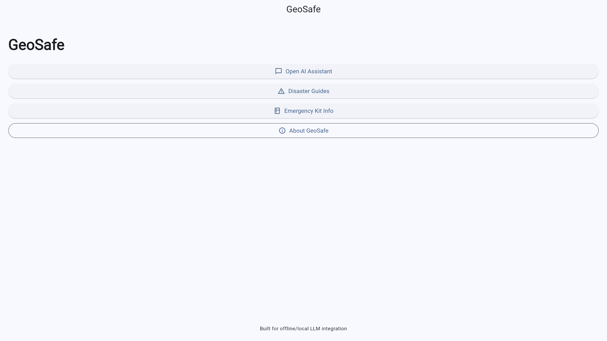 | 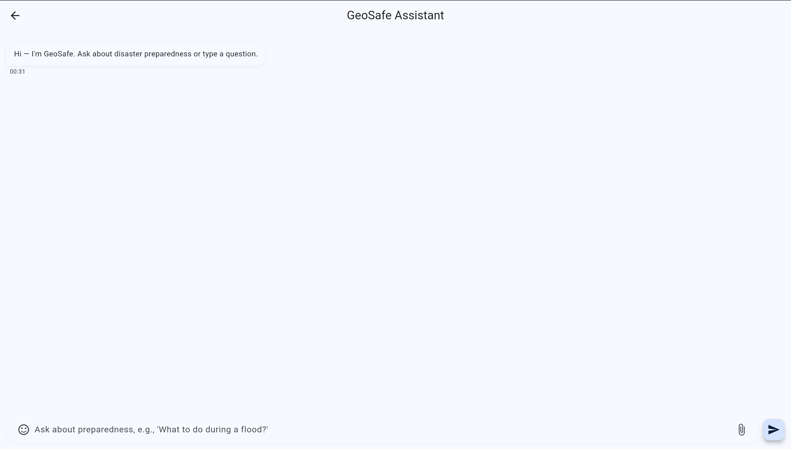 | 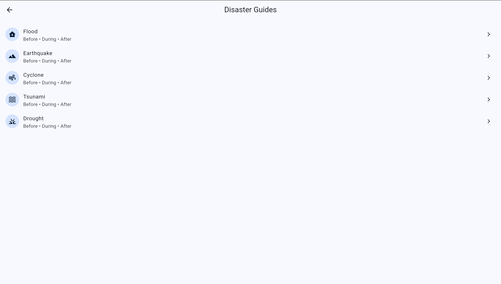 |

| Selected Disaster                                             | Emergency Kit                                             |
| ------------------------------------------------------------- | --------------------------------------------------------- |
| 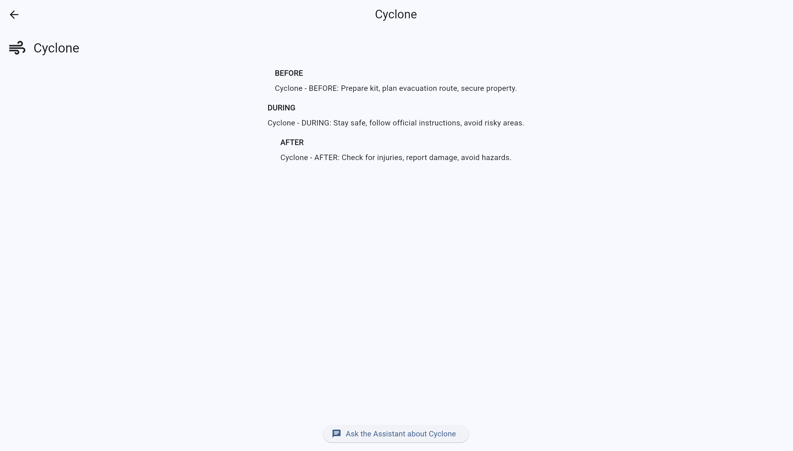 | 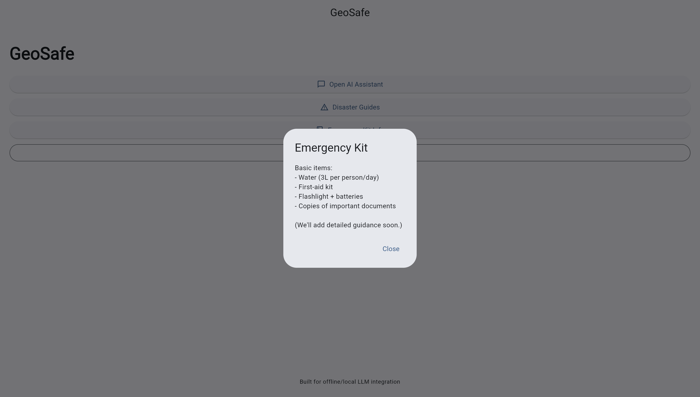 |

---

### 🟩 **Version 2: Modern UI**

*(Folder: `screenshot(new)/`)*

| Home Screen                                          | AI Assistant                                       | Disaster Guides                                                |
| ---------------------------------------------------- | -------------------------------------------------- | -------------------------------------------------------------- |
| 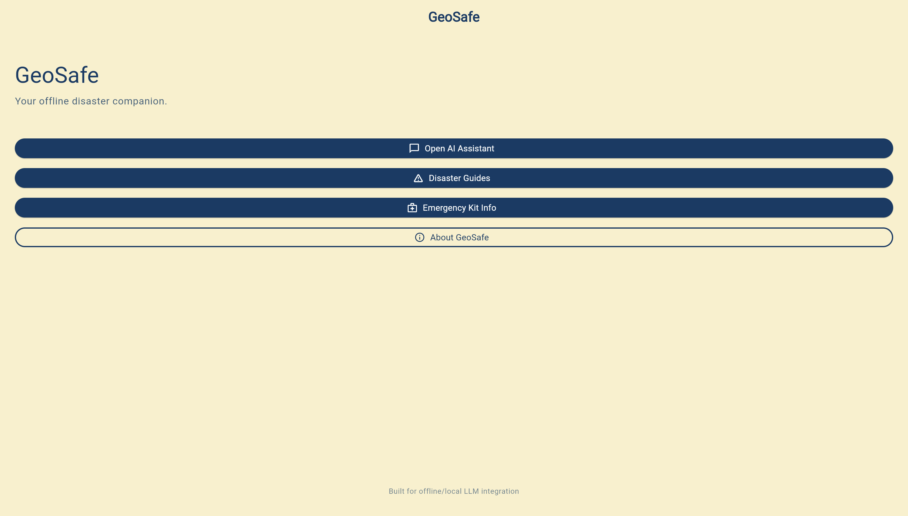 | 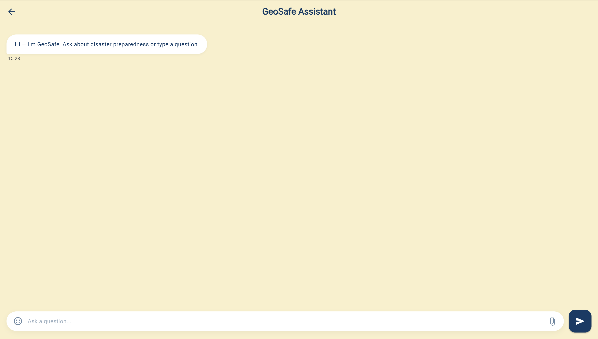 | 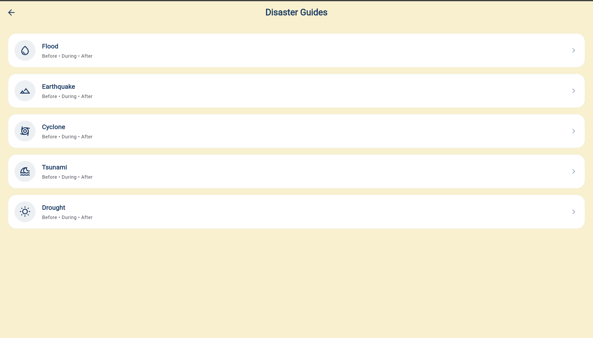 |

| Selected Disaster                                                 | Emergency Kit                                                 |
| ----------------------------------------------------------------- | ------------------------------------------------------------- |
| 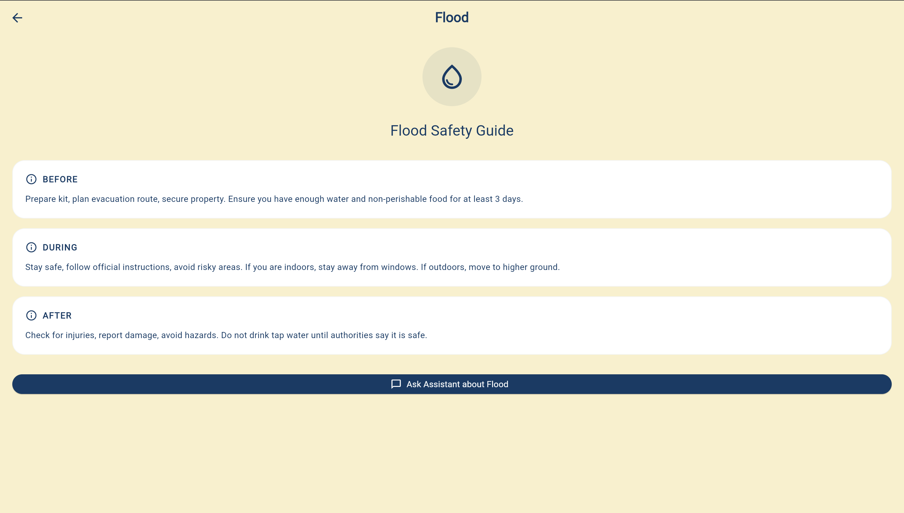 | 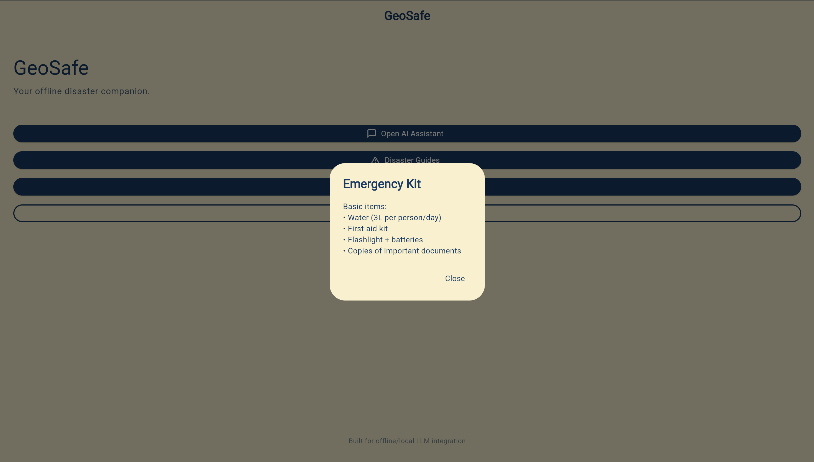 |

---


## 🧠 **System Architecture**

GeoSafe uses a **Two-Layer Offline Architecture** separating UI logic from heavy AI inference.

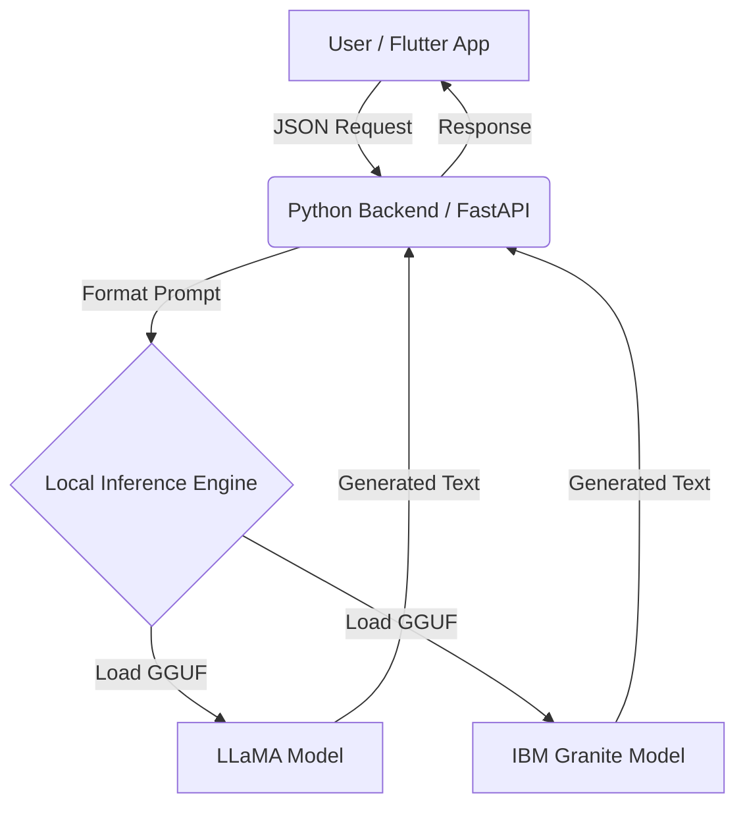

### **Architecture Layers**

1. **Frontend (Flutter)**
   UI, state management, guide navigation.

2. **Backend (Python + FastAPI)**
   Loads models, processes prompts, returns responses.

3. **Local Storage**
   AI models stored on-device in the filesystem.

---

## 📥 **Model Installation (CRITICAL)**

GitHub cannot host large files.
You **must download the models manually** before running the app.

| Model Name                   | Size    | Download Source | Destination                 |
| ---------------------------- | ------- | --------------- | --------------------------- |
| **IBM Granite 3.0 Instruct** | ~1.6 GB | HuggingFace     | `backend/model/`            |
| **LLaMA Model (GGUF)**       | ~460 MB | Google Drive    | `backend/llama.cpp/models/` |

⚠️ **The app will NOT run without these files in the correct folders.**

---
# 📥 Download Required AI Models  

GitHub does **not** allow large model files.  
Download these manually and place them in the correct folders.

| Model | Download Link | Place Inside |
|-------|---------------|--------------|
| **IBM Granite 3.0 Instruct (1.6GB)** | https://huggingface.co/bartowski/granite-3.0-2b-instruct-GGUF/resolve/main/granite-3.0-2b-instruct-Q4_K_M.gguf | `backend/model/` |
| **LLaMA Model (460MB)** | https://drive.google.com/drive/folders/1qMspfLPown863eDvJsNB4KLPiVcU8fhg?usp=sharing | `backend/llama.cpp/models/` |

Folders are **empty** by default to keep the repo clean.

---

## 🛠️ **Installation & Setup**

### **1. Backend Setup (Python)**

```bash
cd backend

# Create virtual environment
python3 -m venv venv

# Activate venv
source venv/bin/activate    # macOS / Linux
# venv\Scripts\activate     # Windows

# Install dependencies
pip install -r requirements.txt
```

---

### **2. Model Placement Verification**

Your folder structure should look like:

```
GeoSafe/
├── backend/
│   ├── model/
│   │   └── granite-3.0-2b-instruct-Q4_K_M.gguf
│   ├── llama.cpp/
│   │   └── models/
│   │       └── llama-model.gguf
```

---

### **3. Run the Backend**

```bash
uvicorn app.main:app --reload

```
or if you want to specify host + port:
```bash
uvicorn app.main:app --host 0.0.0.0 --port 8000 --reload

```
Server runs at:

**[http://localhost:8000](http://localhost:8000)**

---

### **4. Frontend (Flutter)**

```bash
cd frontend

flutter pub get
flutter run
```

---

## 🤝 **Contributing to GeoSafe**

We love contributions!

1. Fork the repo
2. Create a feature branch

   ```
   git checkout -b feature/AmazingFeature
   ```
3. Commit your changes

   ```
   git commit -m "Add AmazingFeature"
   ```
4. Push the branch

   ```
   git push origin feature/AmazingFeature
   ```
5. Open a Pull Request

See **CONTRIBUTING.md** for standards and guidelines.

---

## 📄 **License**

Distributed under the **MIT License**.
See `LICENSE` for more information.

---

## 🌟 **Show Your Support**

If this project helped you, **please give it a ⭐️** on GitHub!

Built with ❤️ for a safer world.

---
